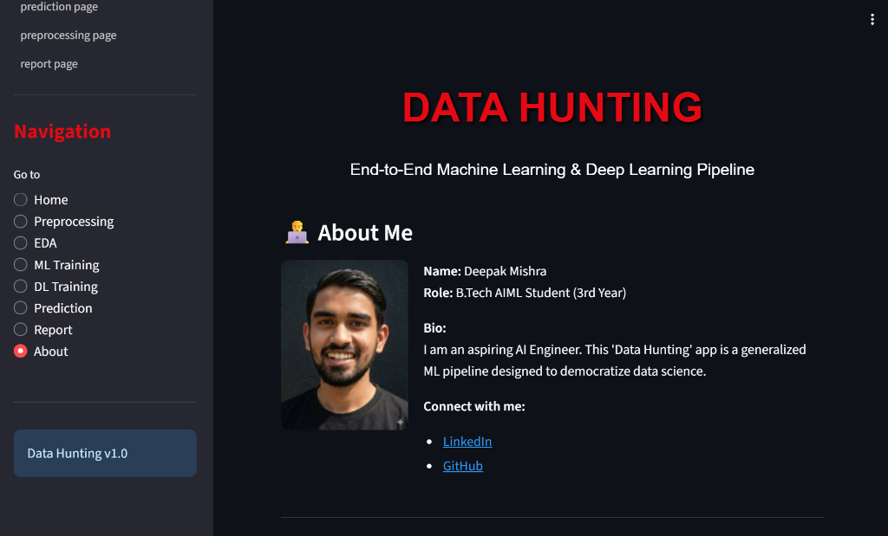

# Data Hunting - Project Structure

Hello everyone i am deepak mishra and i am a student of btech AIML and i am a data hunter.Now i am here to share my knowledge with you all. below is the in depth project structure.

## Overview
Data Hunting is an end-to-end machine learning and deep learning pipeline built with Streamlit. The project has been reorganized into a modular structure for better maintainability and clarity.

## Project Structure

```
Data Hacker/
├── app.py                          # Main application entry point
│
├── config/                         # Configuration settings
│   ├── __init__.py
│   └── settings.py                 # App constants and settings
│
├── core/                           # Core shared functionality
│   ├── __init__.py
│   ├── data_loader.py             # Data loading and snapshots
│   ├── session.py                 # Session state management
│   └── report.py                  # Report generation utility
│
├── features/                       # Feature-specific modules
│   ├── __init__.py
│   │
│   ├── preprocessing/             # Data preprocessing
│   │   ├── __init__.py
│   │   ├── cleaner.py             # Duplicate removal, missing values
│   │   ├── encoder.py             # Categorical encoding
│   │   ├── scaler.py              # Feature scaling
│   │   └── splitter.py            # Train-test split
│   │
│   ├── eda/                       # Exploratory Data Analysis
│   │   ├── __init__.py
│   │   ├── plotter.py             # Dynamic plotting (Plotly)
│   │   └── visualizer.py          # Heatmaps, pairplots (Seaborn)
│   │
│   ├── ml_training/               # Machine Learning
│   │   ├── __init__.py
│   │   ├── trainer.py             # Model training
│   │   └── evaluator.py           # Model evaluation
│   │
│   ├── dl_training/               # Deep Learning
│   │   ├── __init__.py
│   │   └── builder.py             # Neural network building
│   │
│   └── prediction/                # Predictions
│       ├── __init__.py
│       └── predictor.py           # Prediction logic
│
├── pages/                         # Streamlit page modules
│   ├── __init__.py
│   ├── home.py                    # Data loading page
│   ├── preprocessing_page.py      # Preprocessing interface
│   ├── eda_page.py                # EDA interface
│   ├── ml_training_page.py        # ML training interface
│   ├── dl_training_page.py        # DL training interface
│   ├── prediction_page.py         # Prediction interface
│   ├── report_page.py             # Report generation page
│   └── about_page.py              # About page
│
└── ui/                            # UI components
    ├── __init__.py
    ├── header.py                  # Header component
    └── sidebar.py                 # Sidebar navigation
```

## Module Descriptions

### Config (`config/`)
Contains application configuration and settings.

- **settings.py**: Application constants like title, icons, file types, etc.

### Core (`core/`)
Shared utilities used across multiple features.

- **data_loader.py**: Data loading from CSV/XLSX, data snapshots
- **session.py**: Streamlit session state initialization
- **report.py**: Auto-generated report creation

### Features (`features/`)
Business logic organized by feature area.

#### Preprocessing (`features/preprocessing/`)
- **cleaner.py**: Remove duplicates, handle missing values, drop columns
- **encoder.py**: Categorical encoding (Label, One-Hot)
- **scaler.py**: Feature scaling (Standard, MinMax)
- **splitter.py**: Train-test split with target encoding

#### EDA (`features/eda/`)
- **plotter.py**: Dynamic plotting with Plotly (scatter, line, histogram, box)
- **visualizer.py**: Advanced visualizations with Seaborn (heatmap, pairplot)

#### ML Training (`features/ml_training/`)
- **trainer.py**: Train ML models (Logistic, Tree, Forest, SVM, KNN)
- **evaluator.py**: Evaluate models with metrics and visualizations

#### DL Training (`features/dl_training/`)
- **builder.py**: Build and train neural networks with Keras/TensorFlow

#### Prediction (`features/prediction/`)
- **predictor.py**: Make predictions with trained models

### Pages (`pages/`)
Streamlit page components (UI rendering only).

Each page module contains a single `render_*_page()` function that renders the UI for that specific page.

### UI (`ui/`)
Reusable UI components.

- **header.py**: Application header with title
- **sidebar.py**: Navigation sidebar

## How It Works

1. **`app.py`**: Entry point that sets up the page config, initializes session state, and routes to the appropriate page based on sidebar selection.

2. **Page Rendering**: Each page imports only the features it needs and renders the UI.

3. **Feature Modules**: Contain pure business logic without any Streamlit UI code (except for displaying results).

4. **Session State**: Managed centrally in `core/session.py`, stores uploaded data, cleaned data, and trained models.

## Running the Application

```bash
streamlit run app.py
```

## Benefits of This Structure

1. **Separation of Concerns**: UI (pages) is separate from business logic (features)
2. **Modularity**: Each feature has its own folder with focused modules
3. **Reusability**: Core utilities can be used across features
4. **Maintainability**: Easy to locate and modify specific functionality
5. **Scalability**: Easy to add new features or pages
6. **Testability**: Business logic is isolated and can be unit tested
7. **Clear Navigation**: Folder structure mirrors the application flow

## Adding New Features

1. Create a new folder in `features/` with appropriate modules
2. Add `__init__.py` to export public functions
3. Create a page in `pages/` to provide the UI
4. Import the page in `app.py` and add routing logic
5. Register the page in the sidebar (`ui/sidebar.py`)
